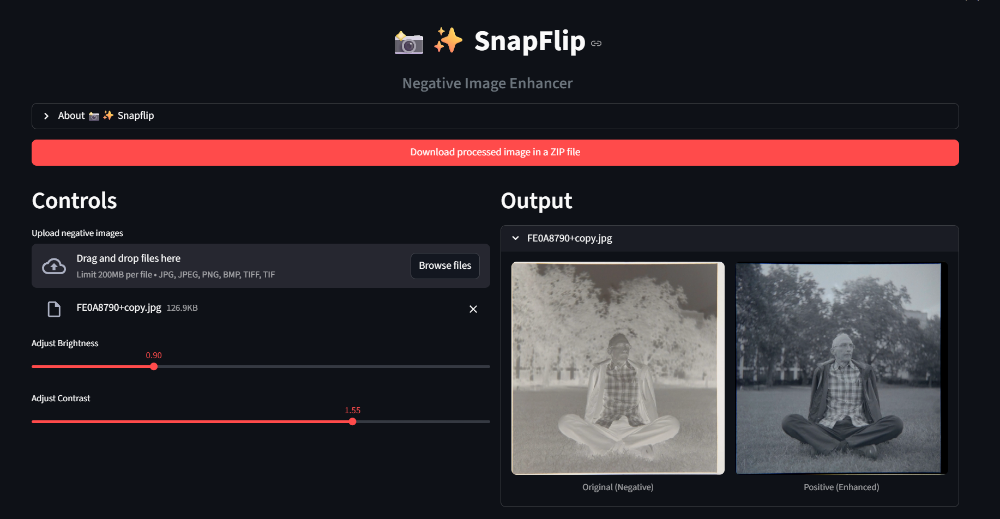
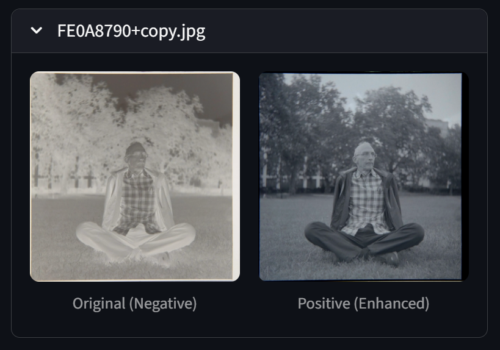

<!-- Code Generated by Sidekick is for learning and experimentation purposes only. -->

# 📸✨ SnapFlip: Negative Image Enhancer

SnapFlip is a streamlined web app for converting photographic negatives into vivid positive images. Whether you're digitizing old film, restoring family memories, or enhancing creative projects, SnapFlip makes the process simple and intuitive.

---

## Features

- **Batch Upload & Processing:** Easily upload multiple negatives in popular formats (JPG, PNG, TIFF, BMP).
- **Instant Conversion:** Advanced algorithms invert colors and restore your images to their true, positive form.
- **Custom Enhancements:** Fine-tune brightness and contrast to achieve the perfect look.
- **Side-by-Side Comparison:** View original negatives and enhanced positives together for quick evaluation.
- **Bulk Download:** Export all processed images in a convenient ZIP file.

---

## Getting Started

### Prerequisites

- Python 3.8+
- [Streamlit](https://streamlit.io/)
- Pillow (`pip install pillow`)
- Other dependencies as listed in `requirements.txt`

### Installation

1. **Clone the repository:**
    ```bash
    # Code Generated by Sidekick is for learning and experimentation purposes only.
    git clone https://github.com/d-evil0per/snapflip.git
    cd snapflip
    ```

2. **Install dependencies:**
    ```bash
    # Code Generated by Sidekick is for learning and experimentation purposes only.
    pip install -r requirements.txt
    ```

3. **Run the app:**
    ```bash
    # Code Generated by Sidekick is for learning and experimentation purposes only.
    streamlit run app.py
    ```

---

## Usage

1. **Upload** your negative images (JPG, PNG, TIFF, BMP).
2. **Adjust** brightness and contrast as needed.
3. **Preview** the enhanced positive images side-by-side with the originals.
4. **Download** all processed images as a ZIP file.

---

## Screenshots

<!-- Add screenshots here if available -->



---

## Contributing

Contributions are welcome! Please open an issue or submit a pull request for improvements, bug fixes, or new features.

---

## License

This project is licensed under the MIT License. See the [LICENSE](LICENSE) file for details.

---

## Author

Made with ❤️ by **Rahul Dubey**  
[GitHub Repository](https://github.com/d-evil0per/snapflip)

